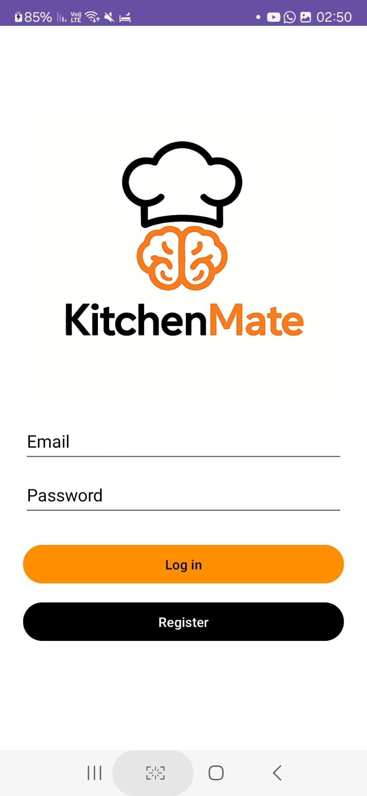
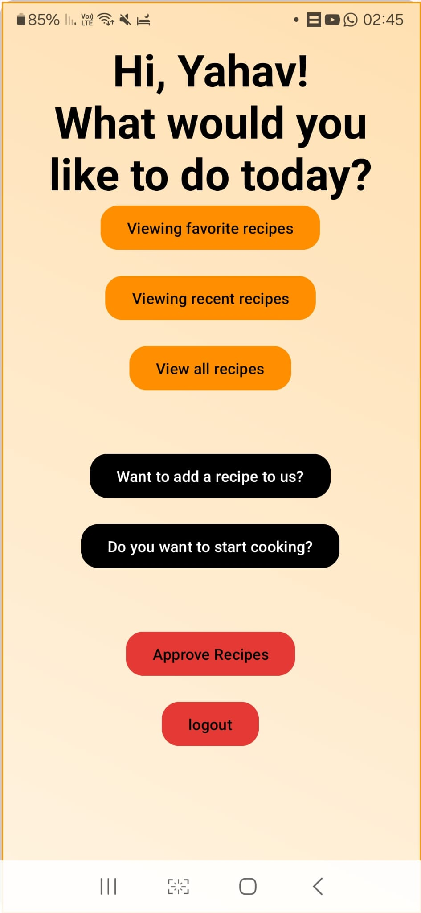
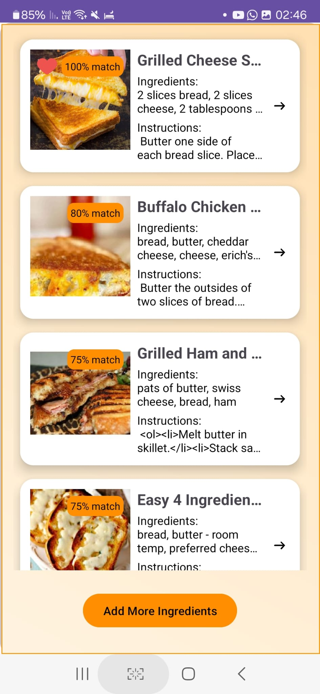
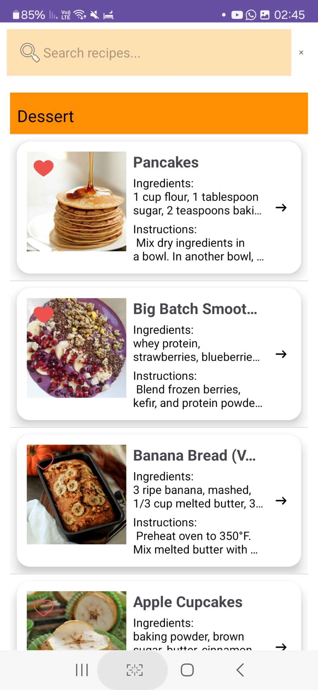
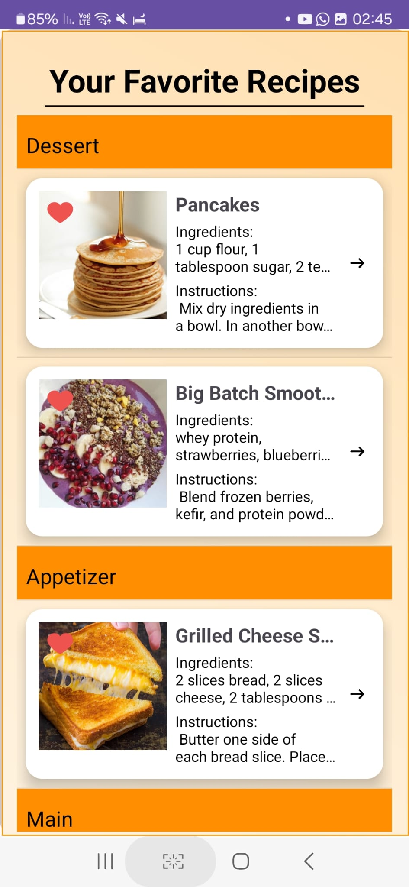
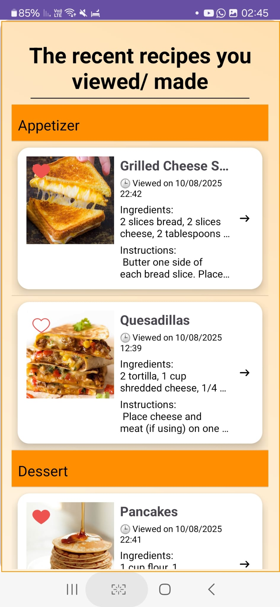

# 🍳 KitchenMate
KitchenMate is a smart Android app for customizing recipes based on the user's available ingredients. The app enables smart search, scanning, saving, and management of recipes backed by Firebase, while integrating external sources and ML-based ingredient recognition.

---

## ✨ Main Features

- Ingredient matching against your pantry items
- Recipe Management - User-generated recipes + admin approval workflow (pending → recipes)
- GET integration with Spoonacular to enrich results / fallback when Firestore has no good match
- 🖼️ On-device ML model: recognize fruits & vegetables from the camera
- 📷 Barcode scanner for fast item entry (ZXing)
- 📄 OCR + PDF/TXT import to capture recipes without typing
- Personal favorites (❤️)recipes tracking
- Images stored in Firebase Storage
- Android (Kotlin), Firebase (Auth/Firestore/Storage), Retrofit/OkHttp, Glide
- Viewing history – Displays the latest recipes the user has opened + sort by timestamp
- Finding recipes by searching for the recipe name
- Visual ingredient highlighting: Green = user has it, Red = missing

  ---

## Watch the App in Action

▶️ **Demo video:** [Click here to watch the video](https://streamable.com/493zsk)

---

## 🧠 Highlights & Mechanics

- **Matching pipeline**:
  1) Firestore full match 
  2) Firestore with up to 3 missing ingredients 
  3) Spoonacular (full or up to 3 missing) 
  4) “No matching recipes” screen
- **Serializable-based navigation** for opening recipe details (with safe null handling)
- **User flows/screens**:
  - Enter ingredients (manual / barcode / gallery / camera)
  - Matched recipes
  - All recipes (unfiltered)
  - Favorites, Recents
  - Add recipe (manual / OCR) → Pending → Admin approval
  - Recipe details with colored ingredients and image
- **Admin-only flow** for moderating user-submitted recipes
- **Robust text styling** via `TextStylingUtils` (coloring known ingredients only)

---

## 🛠 Technologies used

- **Development language**: Kotlin
- **Database**: Firebase Firestore
- **Image storage**: Firebase Storage
- **External APIs**: Spoonacular
- **Machine Learning**: MobileNet v2 + TensorFlow Lite
- **OCR**: ML Kit / Tesseract OCR
- **UI**: Android XML Layouts, Glide for loading images
- **Utils:** Coroutines, Serializable models
  
---

## 📂 Project Structure

  app/
├── src/
│ └── main/
│ ├── AndroidManifest.xml
│ ├── assets/
│ │ └── labels.txt # ML labels for produce detection
│ ├── java/dev/yahaveliyahu/kitchenmate/
│ │ ├── AddRecipeActivity.kt
│ │ ├── AdminApprovalActivity.kt
│ │ ├── ImageMigrationActivity.kt
│ │ ├── MainActivity.kt
│ │ ├── RecipeAdapter.kt
│ │ ├── model/
│ │ │ ├── Recipe.kt
│ │ │ └── RecipeMatch.kt
│ │ ├── service/
│ │ │ ├── RecipeMatcher.kt
│ │ │ ├── RecipeService.kt
│ │ │ └── SpoonacularService.kt
│ │ ├── ui/
│ │ │ ├── add/
│ │ │ │ ├── AddRecipeWayChoosingActivity.kt
│ │ │ │ ├── ImportRecipeActivity.kt
│ │ │ │ └── OCRScanRecipeActivity.kt
│ │ │ ├── auth/
│ │ │ │ ├── LoginActivity.kt
│ │ │ │ └── RegisterActivity.kt
│ │ │ ├── ingredients/
│ │ │ │ ├── GallerySelectActivity.kt
│ │ │ │ ├── WayChoosingIngredientsActivity.kt
│ │ │ │ └── (Camera/Barcode launcher activities)
│ │ │ └── recipes/
│ │ │ ├── AllRecipesActivity.kt
│ │ │ ├── FavoriteRecipesActivity.kt
│ │ │ ├── MatchedRecipesActivity.kt
│ │ │ ├── RecentRecipesActivity.kt
│ │ │ └── RecipeDetailsActivity.kt
│ │ └── utils/
│ │ └── TextStylingUtils.kt
│ └── res/ # drawables, layouts, values, etc.
├── build.gradle.kts
├── settings.gradle.kts
└── gradle.properties

## 📸 Screenshots

| Login | Home | Match Results |
|---|---|---|
|  |  |  |

| recipes | detail recipe | 
|---|---|
|  | |

| favorite | recent | 
|---|---|
|  | |

**Recipe**

**Favorites**

**Recents**

